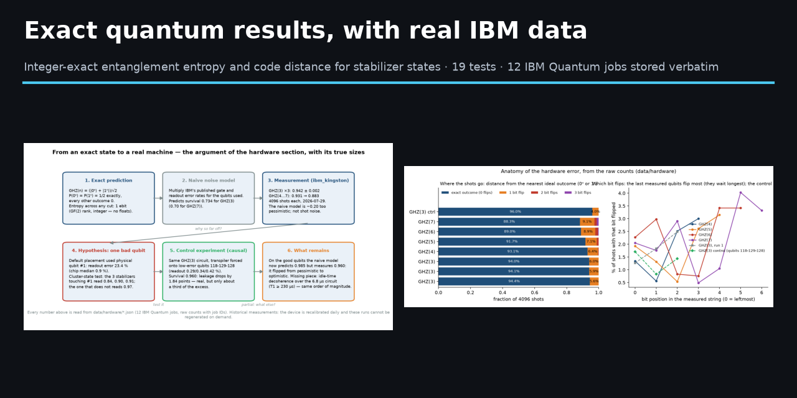
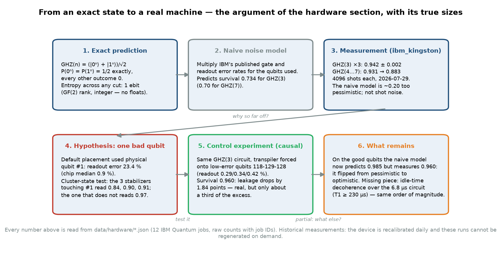
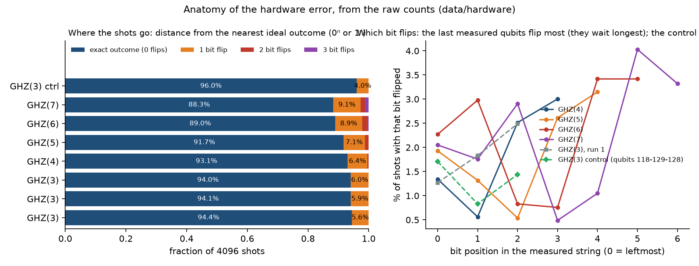
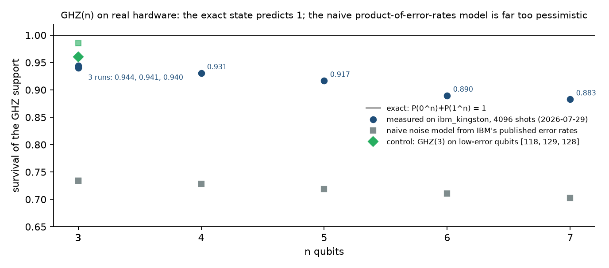
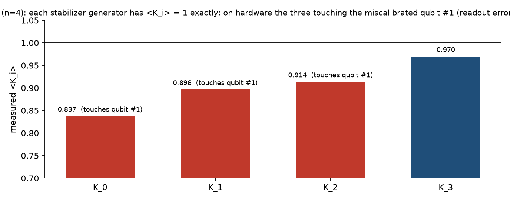
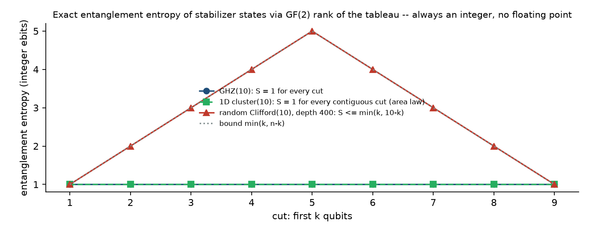
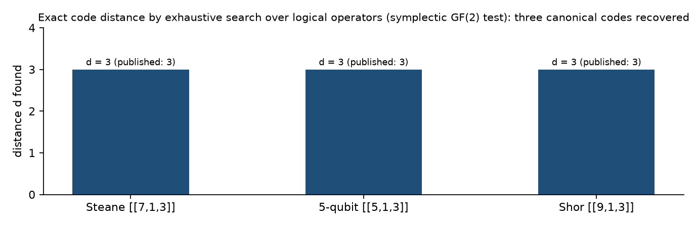

# Exact quantum results, with real IBM data



Exact — integer, no floating point anywhere — computation of two textbook quantities of the
stabilizer formalism, verified against independent oracles and against three canonical
error-correcting codes; an exploratory scaling measurement built on top of it; and a small,
fully-recorded comparison with **real superconducting hardware** (12 IBM Quantum jobs on
`ibm_kingston`, 2026-07-29, raw counts stored verbatim with their job IDs).

This is the complete public record of one line of a 2026 research campaign by Joel Cruz
Cabrera, with the paper, the code, the tests, the data and what each result does and does
not claim.

## What is here

| Piece | What it is | Status |
|---|---|---|
| `src/stabilizer_exact.py` | **Exact entanglement entropy** of a stabilizer state for any bipartition, as the GF(2) rank of the stabilizer tableau restricted to the region minus its size (Fattal–Cubitt–Yamamoto–Bravyi–Chuang 2004), implemented with pure Gaussian elimination over GF(2). **Exact code distance** of a stabilizer code `[[n,k,d]]` by exhaustive search for the lightest logical operator (symplectic GF(2) commutation test). GHZ, 1D cluster state and random Clifford circuit generators. | Library. Uses Qiskit only to build the Clifford tableau; every number it returns is an integer. |
| `tests/` | 19 tests: the entropy formula against Qiskit's floating-point von Neumann entropy on 4 canonical states and **30 random Clifford circuits (30/30 exact matches)**; the distance procedure against **Steane [[7,1,3]], the 5-qubit [[5,1,3]] and Shor's [[9,1,3]]** — all recovered `d = 3`; the area law of the 1D cluster state; and the saturation experiment's invariants. | Pass (`python -m pytest tests`). |
| `experiments/entrelazamiento_saturacion_clifford.py` | Depth at which a random Clifford circuit (50 % one-qubit gate, 50 % random CNOT per step) saturates the half-chain entropy at `n/2`: `t_sat ≈ 14 n` for `n = 10, 20, 40, 80`. | **Exploratory, model-specific**; reported as an empirical scaling, not a theorem. |
| `experiments/ghz_hardware_real.py`, `experiments/cluster_state_hardware_real.py` | The hardware runs and their analysis (exact fractions over 4096 shots). | Historical data, analysed exactly. |
| `data/hardware/*.json` | **One file per IBM Quantum job** (12 jobs): raw counts, exact prediction, measured survival/expectation as an exact fraction, the naive noise-model prediction, and for the control run the published `T1/T2` and the circuit duration. `index.json` lists them. | The primary data of the hardware section. |
| `paper/` | *Exact Entanglement Entropy and Code Distance for Stabilizer States* (tex + pdf, 508 lines). | Draft; not submitted anywhere; see "Status of the paper". |
| `figures/` | Generated by `scripts/make_figures.py`; the computed panels assert their theorem before drawing, the hardware panels only read `data/hardware`. | |
| `catalog/` | The three raw research records (Q1 entropy, Q2 distance, Q3 saturation) as written during the campaign. | |

## The hardware comparison, plainly

The exact GHZ state on `n` qubits gives `P(0ⁿ) + P(1ⁿ) = 1`. On `ibm_kingston` (156-qubit
Heron), 4096 shots per circuit, Qiskit Runtime `SamplerV2`, 2026-07-29:

| circuit | job ID | measured `P(0ⁿ)+P(1ⁿ)` | naive noise model |
|---|---|---|---|
| GHZ(3), run 1 | `d9kuc78ii2cc73egnv4g` | 0.9441 | 0.7337 |
| GHZ(3), run 2 | `d9kukujhdfks73ck7g0g` | 0.9412 | 0.7337 |
| GHZ(3), run 3 | `d9kul9bjf64c739iolog` | 0.9402 | 0.7337 |
| GHZ(4) | `d9kumsqbr2fc73e7tsvg` | 0.9307 | 0.7286 |
| GHZ(5) | `d9kuolabr2fc73e7tvf0` | 0.9167 | 0.7187 |
| GHZ(6) | `d9kv0tibr2fc73e7udjg` | 0.8896 | 0.7104 |
| GHZ(7) | `d9kv4ojjf64c739ipdgg` | 0.8828 | 0.7025 |
| GHZ(3) **control**, qubits 118-129-128 | `d9l04c8ii2cc73egqna0` | 0.9602 | 0.9853 |

Three findings, each at its measured size:

1. **The naive model — multiply IBM's published gate and readout error rates — is far too
   pessimistic** (by ~0.20) on the default transpiler placement. The three GHZ(3) repeats
   agree to `±0.002`, so the disagreement is not shot noise.
2. **One miscalibrated physical qubit explains part of it.** The default placement used
   qubit #1 (published readout error 23.4 % that day); the 1D cluster-state runs
   (`d9kveiibr2fc73e7v8k0` … `d9kvhg0ii2cc73egpsvg`) measure each stabilizer generator
   `⟨Kᵢ⟩` (exactly 1) and the three generators that touch qubit #1 are the low ones
   (0.837, 0.897, 0.914 vs 0.970). The **control** run — same GHZ(3) circuit forced onto
   verified low-error qubits — cuts the leakage by **1.84 percentage points, about a third
   of the excess**: causal, but partial. We report it at that size.
3. **On the good qubits the naive model flips to optimistic** (predicts 0.985, measures
   0.960), by an amount consistent in order of magnitude with idle-time decoherence over the
   circuit's 6.8 µs (`T1 ≈ 230–290 µs`), which a product-of-error-rates model does not
   contain.





The second infographic is the part the summary numbers hide: **almost every error is a
single bit flip** (2-flip events are ≤ 2 %, 3-flip ≤ 1 %), and in the default placement the
flips concentrate on the last-measured positions, which is what one expects if idle time
before readout matters; on the control chain the flip rate is flat and low across all three
positions.




These are **historical measurements**: the machine is recalibrated daily and the numbers
cannot be regenerated on demand, which is exactly why the raw counts are stored. They are
not "verified exact" in the sense the rest of the repository uses; they are evidence of a
different kind — how far a real device sits from the exact state, and how well a naive
public-data model predicts that.

## What is exact




* Entanglement entropy of a stabilizer state is an integer; the GF(2) rank formula computes
  it without a single floating-point operation. Verified: 34 states, 0 mismatches against
  the floating-point oracle.
* Code distance is a combinatorial quantity; the exhaustive search returns it exactly (cost
  grows like `C(n,d)·3^d`, so it is for small codes). Verified on three published codes.
* Neither fact is new — both are standard (Gottesman 1997; Fattal et al. 2004). What is
  offered is a clean, dependency-light, **exact** implementation with its verification, and
  the habit of stating which numbers are exact and which are measured.

## Status of the paper

`paper/estabilizador_cuantico_exacto.tex` is a complete draft. It has **not** been submitted
or deposited. Its prose was written with an AI assistant and has not yet been rewritten by
the author in his own words; the mathematics, code, tests and data in this repository are
what the paper describes, and they are verified independently of the prose. The two
literature citations (Fattal et al. 2004, Gottesman 1997) were checked against the sources;
an earlier draft had the wrong author list for the first and was corrected before this
version.

## Reproducing

```bash
pip install qiskit numpy matplotlib pytest
python -m pytest tests                                  # 19 tests
python experiments/ghz_hardware_real.py                 # exact analysis of the stored GHZ runs
python experiments/cluster_state_hardware_real.py       # ... and of the cluster-state runs
python experiments/entrelazamiento_saturacion_clifford.py   # ~6 min: the saturation scaling
python scripts/export_hardware_data.py                  # regenerates data/hardware from the scripts
python scripts/make_figures.py                          # the figures, with their internal checks
python scripts/make_infographics.py                     # the two infographics, read from data/hardware
```

Re-running on hardware needs an IBM Quantum account; the circuits are `ghz_state(n)` and
`cluster_state_1d(4)` from `src/stabilizer_exact.py`, transpiled by Qiskit's default pass
(the control run pinned `initial_layout=[118, 129, 128]`).

## How this was produced

Directed by Joel Cruz Cabrera; code, tests, analysis scripts and this text written with an
AI assistant (Claude, Anthropic). Every exact claim is covered by a test; every hardware
number is a stored job record with its ID; the exploratory result is labelled as such.

## License

Apache 2.0 for code and data; the paper draft is © the author.
